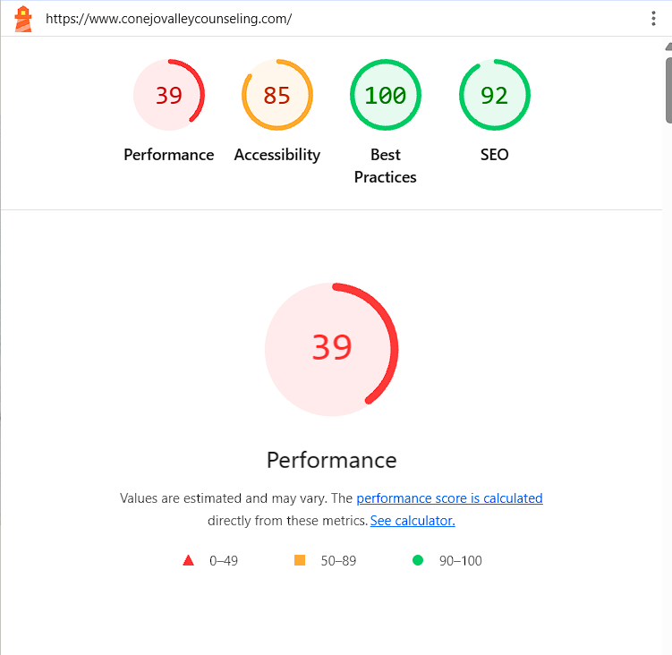
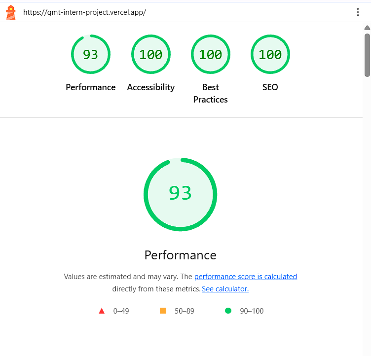

# Dr. Maya Reynolds Website — First Draft

This is the first draft of a modern, responsive website for Dr. Maya Reynolds, a licensed clinical psychologist based in Santa Monica, California. The goal of this version is to establish the brand direction, communicate the practice in a warm and trustworthy way, and create a calm digital experience that aligns with the tone of therapy and healing.

This draft is intentionally designed to feel polished and high-quality while still leaving space for refinement. It reflects the early stages of the project: the structure, voice, content flow, and visual language are all in place, and the site is positioned as a strong foundation for the next iteration with client feedback, final copy, and more advanced optimization.

## What this first draft includes

- A refined homepage with a welcoming hero section and clear calls to action
- Practice-focused messaging around anxiety, trauma, burnout, and nervous-system regulation
- Informational sections that explain the therapeutic approach and the client experience
- Dedicated pages for services, office details, FAQs, contact, privacy, and practice disclosures
- Warm, editorial visuals with a soft neutral palette and elevated typography
- Responsive layouts across desktop and mobile screens
- Search-engine metadata and sitemap structure for future launch readiness

## The overall direction

This first draft aims to create a sense of calm, trust, and emotional safety from the very first scroll. The look and feel are grounded in warmth, clarity, and professionalism, with the intent of helping prospective clients feel at ease before even scheduling a consultation.

The site is designed to balance:

- Clinical credibility
- Emotional warmth
- Clear information architecture
- Ease of navigation
- A premium, modern brand presence

## Performance comparison

Performance was evaluated using the same testing environment for both sites. The comparison below presents the Lighthouse scores for the reference site, Conejo Valley Counseling, and the current Dr. Maya Reynolds first draft.

### Lighthouse score comparison

| Category | Reference site — Conejo Valley Counseling | Dr. Maya Reynolds first draft | Difference |
|---|---:|---:|---:|
| **Performance** | 39 | **93** | **+54 points** |
| **Accessibility** | 85 | **100** | **+15 points** |
| **Best practices** | 100 | **100** | No change |
| **SEO** | 92 | **100** | **+8 points** |

### Performance result

The Dr. Maya Reynolds first draft scored **93 compared with 39** for the reference site. This is:

- **54 Lighthouse points higher**
- **138.5% higher relative to the reference score**
- Approximately **2.38× the reference site's Lighthouse performance score**

> Note: Lighthouse scores are benchmark scores, not direct measurements of page-load time. Therefore, it is more accurate to say that the first draft achieved a **138.5% higher performance score** or a **2.38× higher Lighthouse score**, rather than claiming that the site is 2.38× faster in seconds.

### Side-by-side visual comparison

| Reference site | Current draft |
|---|---|
| [](./conejo.png) | [](./gmt.png) |
| **Conejo** — [conejovalleycounseling.com](https://conejovalleycounseling.com) | **Dr. Maya Reynolds** — [gmt-intern-project.vercel.app](https://gmt-intern-project.vercel.app/) |

### Score sources

- Reference site: [conejovalleycounseling.com](https://conejovalleycounseling.com)
- Current first draft: [gmt-intern-project.vercel.app](https://gmt-intern-project.vercel.app/)
- Both sites were tested in the same environment.
- Screenshots of the results are included in [`conejo.png`](./conejo.png) and [`gmt.png`](./gmt.png).

### What the results demonstrate

The comparison shows that the first draft is already performing strongly as an early concept. In addition to the higher Performance score, it achieved perfect scores for Accessibility, Best Practices, and SEO in the recorded test.

At this stage, the goal is not to suggest that the first draft is final. Instead, these results provide a strong starting point for continued refinement while preserving the visual quality and calm experience required for the practice.

### Performance-focused technical choices

- **Next.js App Router** — Supports modern rendering patterns and SEO-friendly page structure
- **Component-based architecture** — Reusable sections reduce duplication and improve maintainability
- **Tailwind CSS** — Utility-first styling keeps the design system consistent
- **Sharp integration** — Supports image optimization in production builds
- **Metadata and sitemap** — Supports search engine crawling and social sharing
- **Semantic structure** — Helps support accessibility and maintainable content organization

### Next steps for performance optimization

In future iterations, we can:

- Fine-tune image formats and sizes for different devices and network conditions
- Continue measuring and optimizing Core Web Vitals, including LCP, INP, and CLS
- Test font-loading performance under slower network conditions
- Review and compress production asset sizes
- Implement caching strategies for repeat visitors
- Repeat Lighthouse testing after final content and imagery are approved

## Tech stack

- [Next.js](https://nextjs.org/) 16.3.6
- [React](https://react.dev/) 19.2.8
- TypeScript
- Tailwind CSS 4
- ESLint
- Sharp for image handling and optimization

## Project structure

```text
.
├── public/
│   └── images/                 # Brand photography and visual assets
├── src/
│   ├── app/                    # App Router pages and metadata files
│   │   ├── about/
│   │   ├── contact/
│   │   ├── disclaimer/
│   │   ├── faqs/
│   │   ├── good-faith-estimate/
│   │   ├── methods/
│   │   ├── office/
│   │   ├── privacy-policy/
│   │   ├── specialties/
│   │   ├── globals.css
│   │   ├── layout.tsx
│   │   ├── page.tsx
│   │   ├── robots.ts
│   │   └── sitemap.ts
│   ├── components/             # Reusable site sections
│   └── data/                   # Structured practice content
├── conejo.png                  # Reference site performance comparison image
├── gmt.png                     # Current draft performance comparison image
├── next.config.ts
├── package.json
├── postcss.config.mjs
├── tsconfig.json
└── README.md
```

## Getting started

### Install dependencies

```bash
npm install
```

### Run the development server

```bash
npm run dev
```

Then open:

```text
http://localhost:3000
```

## Available commands

```bash
npm run dev          # Start dev server with Webpack
npm run dev:turbo    # Start dev server with Turbopack
npm run build        # Create production build
npm run start        # Serve production build
npm run lint         # Run ESLint
```

## Notes for the client-facing presentation

This is still the first draft of the website, but it already communicates the intended tone of the practice: calming, intelligent, grounded, and warm. The design direction aligns with the therapeutic brand, and the structure is ready for refinement as we continue to shape the final messaging, content, and performance strategy.

At this stage, the project should be understood as a strong concept foundation rather than a final production version. The work ahead includes:

- Content refinement and final copy approval
- Performance tuning and Core Web Vitals optimization
- Visual polish and brand consistency review
- Accessibility audit and improvements
- Launch readiness and SEO finalization

## Disclaimer

This first draft is intended as a concept and presentation version of the website. Final legal, clinical, and marketing copy should be reviewed and approved by Dr. Maya Reynolds before public launch.
